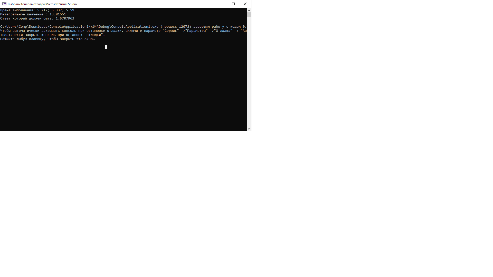
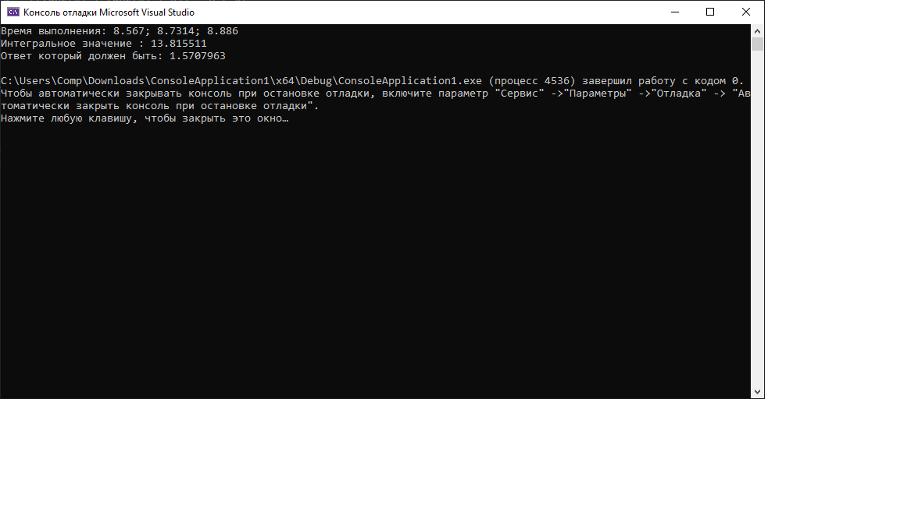

# Лабораторная работа

### Задание:

Реализуйте параллельные алгоритмы, использующие метод прямоугольников и формулу Симпсона для подсчета интегралов. Точные значения интегралов указаны для проверки численных вычислений. В случае, если в верхнем пределе интегрирования указан знак бесконечности, то в расчете необходимо заменить его на 106. 
Сравните время численного интегрирования для последовательной и параллельной реализации. Какое ускорение выполнения программы предоставляет переход к многопоточной версии?

$$
\int_0^{\infty} \dfrac{dx}{1+x^{2}}=\dfrac{\pi}{2}
$$

[Код приложения](main.cpp)

### Результат работы:

По методу прямоугольников

По методу Симпсона
