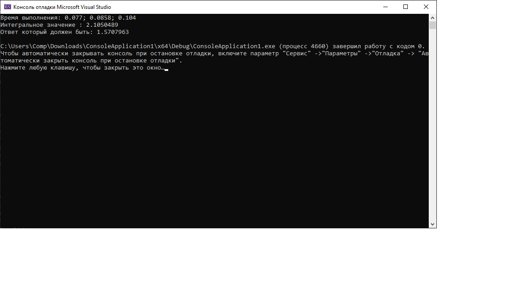

# Лабораторная работа

### Задание:

В качестве методов приближенного вычисления двойных интегралов рассмотрим параллельные реализации метода:

**Ячейки**

[Код приложения](main.cpp)

### Результат работы:

