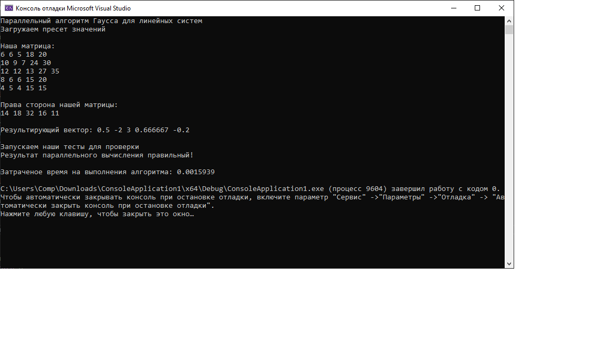

# Лабораторная работа

### Задание:

Решите систему линейных уравнений согласно варианту параллельным методом Гаусса.

$$
6x_1 + 6x_2 + 5x_3 + 18x_4 + 20x_5 = 14,\\
10x_1 + 9_2 + 7x_3 + 24x_4 + 30x_5 = 18,\\
12x_1 + 12x_2 + 13x_3 + 27x_4 + 35x_5 = 32,\\
8x_1 + 6x_2 + 6x_3 + 15x_4 + 20x_5 = 16,\\
4x_1 + 5x_2 + 4x_3 + 15x_4 + 15x_5 =11.\\
$$

[Код приложения](main.cpp)

### Результат работы:

