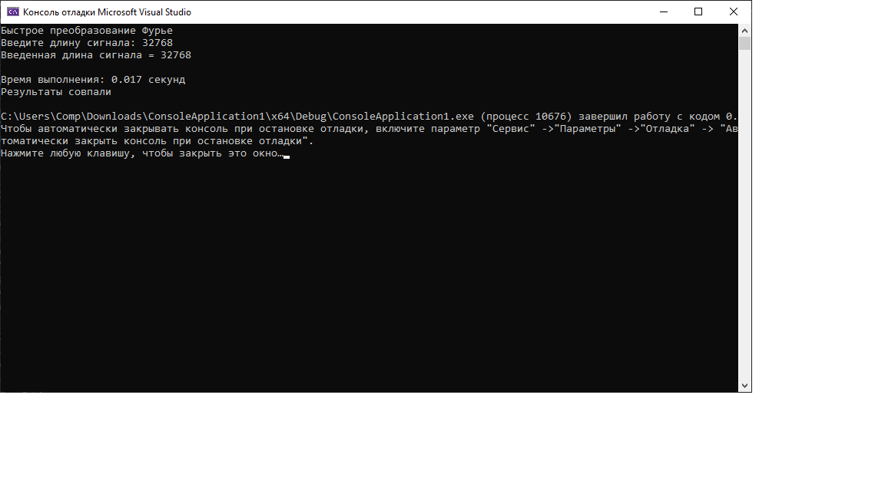

# Лабораторная работа

### Задание:

Проведите эксперименты для последовательного и параллельного вычислений БПФ, результаты занесите в таблицу 1.
Номер теста | Размер входного сигнала | Мин. время работы последовательного приложения (сек) | Мин. время работы параллельного приложения (сек) | Ускорение
----|---|----|----|----
1 | 32768 | | |

Оцените эффективность динамического планирования в OpenMP-версии по сравнению со статическим:

[Код приложения](main.cpp)

### Результат работы:

