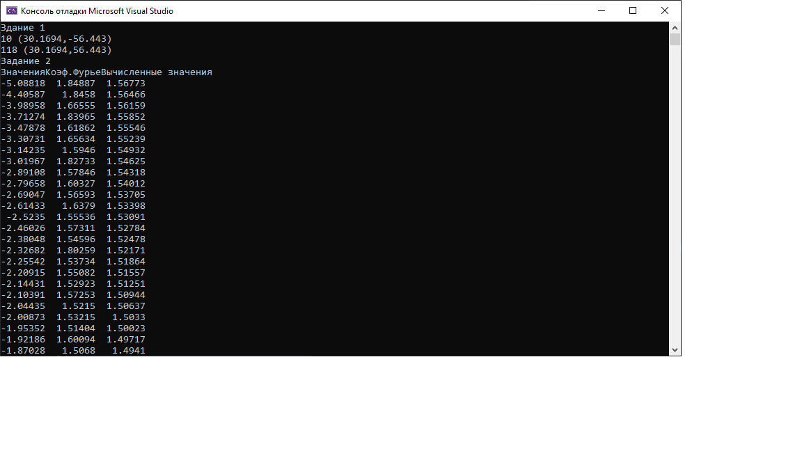

# Лабораторная работа

### Задание:

Периодический сигнал с периодом T, равным 1 секунде, задается функцией слева от знака равенства. Выполните дискретизацию сигнала таким образом, чтобы разрешение по частоте составляло 1 Hz при числе отсчетов 1024. Согласно своему варианту:

[Код приложения](main.cpp)

### Результат работы:

